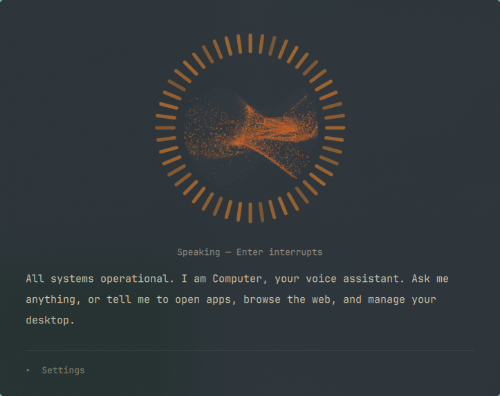

# Computer AI



A Jarvis-style voice assistant plugin for the [Omarchy](https://omarchy.org)
shell. It lives as a **bar icon** with a drop-down panel — click the icon or
press a hotkey, speak, and a pluggable AI agent answers aloud — and can
operate the desktop (launch apps, drive the browser, set reminders, control
media) within a user-approved permission policy.

- **Bar widget**: an icon in the status bar with a panel that drops down
  beneath it, just like the bluetooth or audio widgets — click away to
  close. The agent lives for the whole shell session, so closing the panel
  only *hides* it: a turn keeps running and still speaks aloud with the panel
  shut. The icon shows the state at a glance — an orbit at rest, red bars
  reacting to your mic while it listens, ember bars dancing to the reply
  while it speaks, and an ember dot when something is waiting for your
  answer — on every screen, so a card raised by a turn you started elsewhere
  still finds you. The mark itself is drawn rather than set in a font: a
  still core with two closed ripple rings around it, turning while the agent
  works and holding still at rest. On a multi-monitor
  setup every bar shows the *same* session: the hotkey opens the panel on
  the screen you're working on, and a turn started there keeps its
  transcript, activity and orb when you reopen the panel anywhere else.
- **Orb UI**: audio-reactive particle swarm (a port of the omarchyplugins.com
  parametric canvas) with live mic levels while listening, speech-synced
  playback animation, and mood morphs per phase. At rest it is water instead:
  a body of liquid turned by a slow shearing vortex, its surface pushed
  around by layered swells and crossed by drifting caustics, evolving through
  five weathers and repeating on no timescale you would sit and watch.
- **Mic check**: the level trace from your microphone is kept, but it is a
  diagnostic, not decoration — it stays hidden on turns that worked. It comes
  up on its own when a capture returns nothing, the assistant raises it while
  walking you through calibration, and `Ctrl+M` pins it open. The speech
  threshold is drawn through it, so a flat rust strip ("nothing reached the
  threshold") is visibly a different problem from a busy ember one ("heard
  you, misread the words"). Beside it is a play button: the capture is the
  same audio the transcriber was given, so you can hear whether the recording
  was the problem, with the playhead tracking the trace as it goes.
- **Reads as it speaks**: the reply is lit by where the voice has got to —
  spoken text fades back, the sentence playing is bright, the rest waits in
  between.
- **Shows its work**: an agent turn can run for minutes, so while it works
  the voice bars retract and the *gyre* takes the ring — sweeping arcs, an
  elapsed clock, and the newest step the agent took, with a sonar ping on
  every tool call. `Ctrl+I` opens the full step-by-step log, plus tokens,
  cost and account usage — kept off the face of the panel so the orb
  stays uncluttered.
- **Pipeline**: ffmpeg capture with voice-activity endpointing → Voxtype
  (whisper) transcription → agent harness → Kokoro/Piper TTS.
- **Thinking tone**: a soft, evolving ambient pad plays while the agent works
  — one of four generative moods chosen at random, synthesized live (no audio
  files), low and unobtrusive. It stays silent if other audio is already
  playing and fades out as the reply begins. Toggle it in Settings.
- **Mic calibration by voice**: say "help me tune my microphone" and the
  agent walks it out loud. It measures the audio of the sentence you *just
  spoke* — no "speak now" cue, every turn is a sample — reports the level
  (too hot, too quiet, good) and adjusts mic gain and the endpointing
  thresholds. It raises the panel's mic check while it works, can play the
  capture back to you so you can hear what it heard, and puts the view away
  when it is done. Threshold and silence-window changes take effect on your
  next sentence, without restarting the shell or closing the panel.
- **Agents**: one adapter script per harness in `agents/` (Claude Code, Grok
  CLI, ChatGPT via Codex CLI ship in-tree). The panel's Assistant dropdown
  discovers them automatically; see `agents/README.md` for the contract.
- **Conversations**: threaded per panel session with a 10-minute grace
  window; "start a new conversation" resets on demand.
- **Memory**: persistent markdown memory in `~/.local/share/computer-ai/memory/`
  (index inlined into every turn).
- **Email** (optional): with the [himalaya](https://github.com/pimalaya/himalaya)
  CLI, the assistant can **read**, **draft**, or **send** email from one or
  more of your accounts. Sending always opens the message in an editor for you to review,
  edit, and approve with a keystroke — it never sends on its own. Attachments
  are supported. First use opens a setup window for your address and a Gmail
  App Password (stored in gnome-keyring, never spoken). Behind a one-time grant.
- **Local web fetch** (optional): `bin/localfetch.sh` retrieves a page from
  this machine over your own connection, rather than through the harness
  vendor's servers — so sites resolve and geo-vary as they do for you, and
  the LAN, router and localhost are reachable too. No JavaScript. Behind a
  one-time grant.
- **Permissions**: allowlist in `~/.local/share/computer-ai/claude-settings.json`.
  The agent can request new grants — tool rules, or `Dir(/path)` to reach
  outside `$HOME` — and you approve them on a card in the panel.

## Install

```bash
omarchy plugin add https://github.com/ajoabraham/omarchy-plugin-ajo.computer-ai
# (or for development: clone and symlink)
# ln -s /path/to/computer-ai ~/.config/omarchy/plugins/ajo.computer-ai

# Installing never runs plugin code, so run setup once — it checks
# dependencies, downloads a starter TTS voice, seeds the permission
# policy, and (with --wire) adds the Hyprland keybinding + float rule:
bash ~/.config/omarchy/plugins/ajo.computer-ai/bin/setup.sh --wire

omarchy plugin enable ajo.computer-ai
```

Dependencies (setup.sh checks them all): `voxtype`
(`omarchy voxtype install`), `ffmpeg`, `jq`, pipewire (`pw-play`), and at
least one agent CLI (`claude`, `grok`, or `codex`). Local web fetch also
uses `curl` and `python3`, both already present on Omarchy. TTS lives in
`~/.local/share/computer-ai/` — setup fetches Piper plus one voice; more Piper
voices and the nicer Kokoro engine are documented in `bin/speak.sh`.

`setup.sh --wire` places the bar icon and adds the summon keybinding (or
prints them, without `--wire`). It's a bar widget, so there is no window rule
— it lives in the bar's layout:

```bash
# drop the icon into the bar's right section (move it later with
# `omarchy bar move ajo.computer-ai <left|center|right>`)
omarchy plugin enable ajo.computer-ai right
```

```lua
-- bindings.lua — summon listening on a key (End = Fn+Right on most laptops)
o.bind("End", "Computer", os.getenv("HOME") .. "/.config/omarchy/plugins/ajo.computer-ai/bin/summon.sh")
```

## Security & privilege boundaries

Like all Omarchy shell plugins, this runs unsandboxed with your user
permissions — and unlike most, it drives AI agent CLIs that can execute
commands. Know the boundaries:

- Actions are **three-tiered**, and no general-purpose launcher is
  pre-approved:
  - **Tier 1 — allowed** (seeded from `defaults/permissions.json` into
    `~/.local/share/computer-ai/claude-settings.json`): reversible everyday
    actions, and only through the argv-validating wrappers in `bin/` —
    `desktop.sh` (launch a known app, open an http(s) link), `omarchy-do.sh`
    (a table of `omarchy` verbs, not the CLI itself), `media.sh`, `notify.sh`,
    `clip.sh`, `sysinfo.sh`. Each one refuses arguments outside its own
    grammar. `uwsm-app`, `hyprctl`, `xdg-open` and bare `omarchy` are *not*
    granted: any one of them can launch an arbitrary process, which would
    make every other rule here decorative.
  - **Tier 2 — asked once**: anything else is requested with
    `bin/request-grant.sh` and approved by you on a card in the panel. It
    then persists until you delete the line.
  - **Tier 3 — asked every time**: disruptive or irreversible actions
    (`system reboot`/`shutdown`/`logout`/`lock`/`suspend`, `gpu switch`,
    launching an app outside the known list, fetching from localhost or the
    LAN) call `bin/confirm.sh`, which blocks the turn on a Y/N card. Saying
    yes approves that one action and grants nothing for next time.
  - Upgrading from an older install rewrites the live policy once, retiring
    the broad rules it used to seed and adding the wrappers in their place.
- Agents are also confined to `$HOME` as their working directory, whatever
  the allowlist says. Reaching a runtime or state directory elsewhere needs
  a separate `Dir(/absolute/path)` grant, which lands in
  `permissions.additionalDirectories` and becomes `--add-dir`.
- Escalation is human-gated: an agent may *request* a rule
  (`bin/request-grant.sh`), but only you can approve it, on a card in the
  panel. Grants are permanent until you remove the line from the settings
  file. The system prompt forbids requesting broad rules, sudo, or writes
  outside the plugin's own data directories.
- The activity log is local: `~/.local/share/computer-ai/state/activity.jsonl`,
  truncated at the start of every turn. It holds clipped one-line summaries
  of tool calls, so treat it like scrollback, not like a secret store.
- Browser control (Claude harness) touches your real, logged-in Chromium and
  additionally requires a one-time automation grant in the Claude browser
  extension, where per-site limits are also available. The ChatGPT harness
  runs in Codex's read-only sandbox and takes no actions.
- Web fetches normally run on the agent harness's own infrastructure.
  `bin/localfetch.sh` runs them from here instead — which is the point, since
  a page then sees your address and region — but it also means it reaches what
  only this machine can: localhost, the LAN, the router. That is strictly
  wider than the built-in tool, so it is deliberately absent from the default
  allowlist — the agent must request it and you approve it once on the panel
  card. Beyond that grant, every hop is resolved and classified before the
  request: public addresses are fetched, while loopback, LAN, link-local,
  CGNAT and cloud-metadata addresses each need a per-destination Y/N
  confirmation, every time. The resolved address is pinned for the
  connection (so a name cannot resolve to something else in between),
  redirects are followed one at a time and re-checked at each hop rather
  than by `curl --location`, ambient `~/.curlrc` and proxy settings are
  ignored, and size and time are capped.
- Approving out loud does not weaken the gate. The microphone is armed only
  by a human gesture — the hotkey, or Enter in the panel — never by anything
  the agent does, and the panel does not listen while a reply is being
  spoken, so a reply containing the word "allow" is talking to nobody.
  Approval also has to be the *whole* utterance ("yes", "go ahead"), while a
  refusal only has to start like one, so ambiguity resolves toward not
  acting: "yes but tell me what it does first" is a question, not consent.
  Anything that is not a decision leaves the card up and is treated as
  ordinary speech.
- The boundary is tested, not just described: `bash tests/boundaries.sh`
  checks that the wrappers refuse hostile argv, that disruptive actions do
  not happen without a human yes, that a hostile archive cannot write outside
  its destination, that a cancelled or timed-out turn leaves nothing running,
  and that a spoken "yes, but…" is never read as a yes.
- Voice is an input channel, and so is everything the agent reads: pages,
  mail and browser content all arrive in the same context as your words.
  That is why the boundaries above are enforced by wrappers and gates rather
  than by instructions in the system prompt — an instruction is advice to
  the model, not a control. Keep the allowlist as narrow as you can live
  with.
- Cancelling really cancels. Each turn runs in its own process group, and
  Enter (or the IPC `stop`) terminates the whole group — agent CLI, tools,
  synthesis, playback — escalating to `SIGKILL` and reaping before the panel
  reports idle. Turns also have a wall-clock deadline
  (`COMPUTER_TURN_TIMEOUT`, 10 minutes by default).
- Downloads are pinned and verified. `bin/setup.sh` installs only what
  `defaults/artifacts.json` names, by immutable identity (a release tag, a
  Hugging Face commit revision — never a mutable `main`), checks the SHA-256
  of every file before use, validates archive members against traversal and
  escaping links (`bin/unpack-archive.py`), stages privately and moves into
  place atomically.
- Private by default: state, memory and settings live in `0700` directories
  with `0600` files, durable state is replaced by atomic rename, and the
  microphone capture goes to an unguessable name inside your own runtime
  directory — never `/tmp`.
- One recording is kept, deliberately. Once a turn is transcribed its capture
  is renamed to a single fixed name (`computer-ai-last.raw`, mode `0600`, in
  that same private directory), replacing the previous turn's — because
  `bin/mic-calibrate.sh` tunes the microphone by measuring *the sentence you
  just spoke*, which is what lets it calibrate without asking you to "speak
  on cue". So your most recent utterance is on disk until the next one
  replaces it or you log out. `mic-calibrate.sh` will only read captures from
  that directory. If you would rather keep nothing, delete the file — the
  next turn works fine without it, and only calibration notices.
- Audio is processed locally (Voxtype/whisper STT, Piper/Kokoro TTS);
  transcribed text goes only to the agent CLI you selected.

## Email

`bin/mail.sh` lets the assistant write email through the
[himalaya](https://github.com/pimalaya/himalaya) CLI (`pacman -S himalaya`),
across one or more accounts:

- **Read** ("what's in my inbox", "read the latest from Alice", "any email
  about the invoice") — lists, reads, and searches your mail. Reading leaves
  messages unread, and their content enters the conversation, so the assistant
  summarises rather than reciting long mail.
- **Draft** ("draft an email to …") — saved to your Drafts; you finish it in
  Gmail. Nothing is sent by the plugin.
- **Send** ("send an email to …") — opens the composed message in an editor
  (`$EDITOR`, e.g. nvim), with any attachments listed. You edit
  recipients/subject/body, save, and confirm; only then does himalaya send it.
  Every send is a human keystroke in that window, so a misheard command cannot
  mail anyone.
- **Multiple accounts** — say "send from work"; with more than one account the
  assistant asks which to use. Attach files with your voice request too.

The **first time** you ask for email, the assistant approves the
`Bash(.../mail.sh:*)` grant (a panel card) and opens a **setup window** — a
terminal that asks for a Gmail address and a Gmail App Password (create one at
https://myaccount.google.com/apppasswords; it needs 2-Step Verification). The
password goes into **gnome-keyring** via `secret-tool`; himalaya reads it from
there, so no secret is written to disk. The window verifies the sign-in and
writes the account into `~/.config/himalaya/config.toml`. Run setup again to
add more accounts. Requires `himalaya` and `secret-tool` (`libsecret`).

The password is entered by keyboard in that window, never spoken — voice would
be transcribed into the logs. Messages are built with Python's `email` library
with header values stripped of control characters, so a dictated subject or
recipient cannot inject extra headers.

To set it up manually instead:

```bash
himalaya configure    # himalaya's own account wizard, or:
~/.config/omarchy/plugins/ajo.computer-ai/bin/mail.sh configure
```

## Uninstall

```bash
omarchy plugin remove ajo.computer-ai
```

removes the plugin cleanly. Optional leftovers you may also delete:
`~/.local/share/computer-ai/` (voices, memory, permission policy, state),
`~/.config/omarchy/computer.json`, `~/.config/himalaya/config.toml` and the
keyring entries under service `computer-ai-mail` (`secret-tool clear service
computer-ai-mail`) if you set up email, and the summon keybinding that
`setup.sh --wire` added to `bindings.lua` (`omarchy plugin remove` takes the
icon out of the bar for you).

## Controls

**Bar icon** — left-click toggles the panel; right-click stops the current
turn. **End** (Fn+Right by default) summons it listening from anywhere — but
only when it's idle, so pressing it mid-turn just brings the progress into
view rather than recording over the answer.

**In the panel** — Enter: speak / send / interrupt (while it's working, Enter
cancels) · Esc or click-away: hide the panel (the agent keeps running and
still speaks) · Ctrl+I: show/hide the activity log · `/`: type a message
instead of speaking · Ctrl+M: pin the mic check (trace + playback) open ·
A / D: approve / deny a permission request · Y / N:
allow / refuse one specific action the assistant has stopped to confirm ·
Settings drawer: agent, voice, and the two switches below.

**Answering by voice** — when a card is up you can just say it: "allow",
"yes", "go ahead", "make it so" to approve; "deny", "no", "cancel", "never
mind" to refuse. If the panel is idle, speak as you normally would. If a
turn is mid-flight and stopped on a confirmation, press **End** and answer —
the turn stays running underneath and picks straight back up. The card never
goes away, so the keys and the mouse work exactly as before; turn the whole
thing off with *Answer cards by voice* in Settings.
